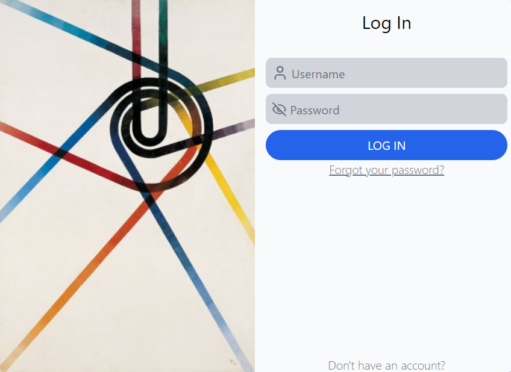

<div align="center">

# Entrega 1 - Programación Web 2

</div>

<center>

</center>

<br>

Para esta entrega se realizó usando la tecnología de ReactJS + Vite. Esta tecnología permite realizar aplicaciones web más versátiles y potentes, esto gracias a los **hooks**, los cuales dan un manejo de los diferentes estados que puede contemplar una aplicación, por ejemplo:

- Esperando la respuesta del servidor
 > En los componentes FormLogin.jsx y FormSignUp.jsx, puedes ver cómo se maneja la espera de la respuesta del servidor:

```jsx
const handleOnSubmit = (e) => {
  e.preventDefault();
  setIsWaitingRes(true);

  axios
    .post("http://localhost:8090/api/authentication/signin", formData)
    .then((res) => {
      sessionStorage.setItem("token", res.data.accessToken);
      setIsWaitingRes(false);
      setResMessage();
      navigate("/home");
    })
    .catch((err) => {
      setIsWaitingRes(false);
      setResMessage(err?.response?.data.message);
    });
};
```

En este código, se utiliza el estado isWaitingRes para mostrar un indicador de carga mientras se espera la respuesta del servidor. Cuando se realiza la solicitud POST, se establece isWaitingRes en true. Una vez que se recibe la respuesta del servidor, se establece isWaitingRes en false y se maneja la respuesta según sea necesario.

- Manejo de errores:

> En los mismos componentes FormLogin.jsx y FormSignUp.jsx, puedes ver cómo se maneja el manejo de errores:

```jsx
.catch((err) => {
  setIsWaitingRes(false);
  setResMessage(err?.response?.data.message);
});
```

En este código, si ocurre un error en la solicitud POST, se captura el error en el bloque catch. Se establece isWaitingRes en false para ocultar el indicador de carga y se muestra un mensaje de error utilizando setResMessage.

## Las dependencias utilizadas para este proyecto fueron:

- Lucide, es una librería de iconos
- Axios, permite realizar peticiones HTTP de forma sencilla
- Tailwind, es una librería de estilos predefinidos
- React Router Dom, hace que el enrutamiento de las páginas sea muy fácil

## Backend del proyecto

Para la parte del servidor se uso el ejemplo de [BezKoder](https://www.bezkoder.com/node-js-jwt-authentication-mysql/). Las tecnologías empleadas en el desarrollo de este servidor web fueron:

- Node.js
- MySQL, como base de datos
- Sequelize, ORM de bases de datos MySQL
- JWT, para la autenticación de los usuarios

El repositorio de este proyecto es el siguiente [web2-backend](https://github.com/OmarBarrios/web2-backend).
